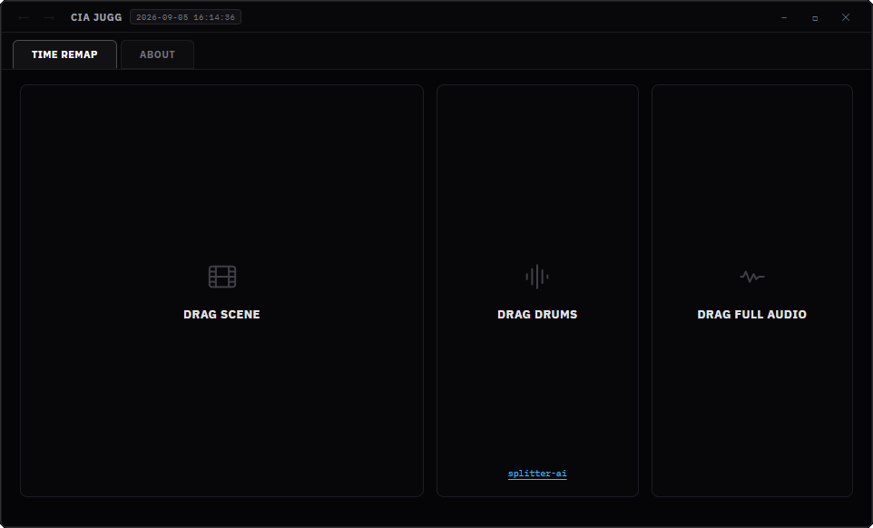

# cia app

Desktop application for beat-synchronized video time remapping and kinetic transform compositing on Windows.

All processing runs locally on the host machine. The application bundles its own ONNX neural inference runtime and FFmpeg toolchain, requiring no cloud services, Python runtime, or external codec installations.

[](https://github.com/ssdme/cia-app-jugg/releases)
[](https://github.com/ssdme/cia-app-jugg/releases)
[](LICENSE)
[](https://github.com/ssdme/cia-app-jugg/releases)

---

## Render Previews

<table>
  <tr>
    <td align="center" width="50%">
      <video src="https://github.com/user-attachments/assets/960ae91f-d6aa-4c61-9bf7-89dd9c6582b9" controls width="100%"></video>
      <br>
      <sub><a href="https://github.com/ssdme/cia-app-jugg/releases/download/v1.0.2/preview1.mp4">Direct Link: preview1.mp4 (2 MB)</a></sub>
    </td>
    <td align="center" width="50%">
      <video src="https://github.com/user-attachments/assets/925d8312-2a50-4117-867f-065f97be912a" controls width="100%"></video>
      <br>
      <sub><a href="https://github.com/ssdme/cia-app-jugg/releases/download/v1.0.2/preview2.mp4">Direct Link: preview2.mp4 (15 MB)</a></sub>
    </td>
  </tr>
</table>

---

## UX



---

## Pipeline & Architecture

### Ingestion Pipeline
- **Scene**: Source footage (MP4, MKV, WEBM, MOV, AVI).
- **Drums**: Isolated percussive audio stem for neural onset and downbeat analysis.
- **Audio**: Target master soundtrack for final audio multiplexing and alignment.

### Neural Beat Detection
- Embedded `beat_this` ONNX model executed via ONNX Runtime C API.
- Sub-frame onset detection and downbeat classification with microsecond timestamp resolution.
- Zero external dependencies: no Python runtime, PyTorch, or GPU driver packages required.

### Time Remapping Curves
- **HARD**: High-gradient velocity ramps, one-frame cuts, and beat-aligned reverse cuts.
- **SMOOTH**: Continuous cubic and bezier easing without reverse velocity.
- **HYBRID**: Alternating snap-and-saddle curve profile with dynamic acceleration.

### Transform & Shader Engine
- **Camera Shakes**: Harmonic damping, bounce, dissolve skew, and squish-pop coordinate transforms.
- **Ambiance Passes**: Highlight bloom, temporal echo-trail frame blending, and CC Deep Dark tone curve.
- **Anti-Flash Mode**: Suppresses rapid luminance delta while preserving coordinate displacement for photosensitivity compliance.

### Export Pipeline
- Hardware-accelerated and software encoding via embedded FFmpeg pipeline.
- Target codecs: **H.264 (AVC)**, **H.265 (HEVC)**, and **VP9**.
- Configurable target bitrates from 5 Mbps to 50 Mbps.
- Geometric output modes: Native, Crop-to-fill, and Stretch.

---

## Installation

Download the standalone installer from the [Releases](https://github.com/ssdme/cia-app-jugg/releases/latest) page:

- **[cia.jugg_1.0.3_x64-setup.exe](https://github.com/ssdme/cia-app-jugg/releases/download/v1.0.3/cia.jugg_1.0.3_x64-setup.exe)** (130 MB)

The installer is self-contained. It bundles all required binaries (`ffmpeg.exe`, `ffprobe.exe`, `beat_this.exe`, `onnxruntime.dll`, and ONNX model weights). No administrative privileges or system environment changes are required.

---

## Building from Source

### Prerequisites
- Node.js 18+
- Rust stable (MSVC toolchain)
- Visual Studio C++ Build Tools

### Build Steps

```powershell
# Clone the repository
git clone https://github.com/ssdme/cia-app-jugg.git
cd cia-app-jugg

# Install frontend dependencies
npm ci

# Run in development mode
npm run tauri dev

# Compile standalone production installer
npm run tauri build
```

---

## License

MIT License (c) 2026 cia213. See [LICENSE](LICENSE) for terms. Bundled third-party binaries and models retain their respective licenses (see [THIRD_PARTY_NOTICES.md](THIRD_PARTY_NOTICES.md)).
